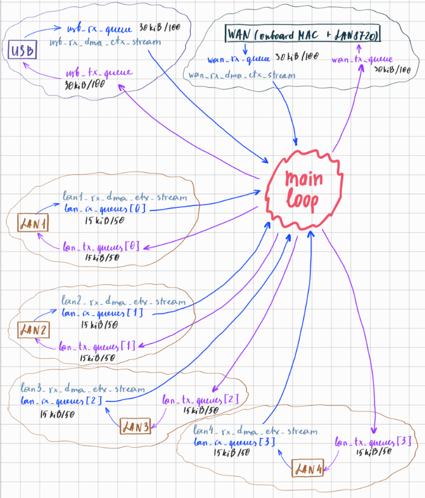

# 1. Ядро Adamantite - эластичные очереди буферов и передача буферов через DMA

## Введение

Для решения задачи маршрутизации пакетов между интерфейсами Adamantite полагается на очень широкие возможности микроконтроллеров семейства STM37H7 по использованию DMA.

Использование контроллера DMA (Direct Memory Access) позволяет значительно повысить эффективность обработки сетевых данных в маршрутизаторе, исключая центральный процессор из цепочки копирования пакетов. Вместо того чтобы CPU "вручную" перекладывал каждый байт между сетевым интерфейсом и буферами памяти, DMA-контроллер выполняет эту работу самостоятельно и параллельно с основными вычислениями. Это освобождает процессор для выполнения более сложных задач (маршрутизации, фильтрации, обработки протоколов), снижает задержки, позволяет кратно увеличить пропускную способность и уменьшить потребление энергии.

Можно выделить 2 вида применения DMA:
1. Передача данных из hardware интерфейса в RAM или из RAM в hardware интерфейс;
2. Передача данных между очередями пакетов, из RAM в RAM.

Первый вид взаимодействия достаточно специфичен для железа, и различные устройства используют различные способы взаимодействия. Однако мы приводим их "к общему знаменателю" при помощи внутренней структуры данных Elastic Queue (далее очередь) и механизма передачи данных между ними, основанном на DMA Mem-to-Mem streams. Это позволяет нам построить универсальное ядро, базирующееся на очередях.

Так, для поддержки определенного вида устройств необходимо реализовать 2 функции: аллоцирование и заполнение буферов пакетов на очереди RX из устройства при помощи DMA; а также чтение и передачу буферов пакетов из очереди TX на устройство, также при помощи DMA, с последующим его освобождением в RX очереди.  

Дальнейшее перемещение буферов между интерфейсами и их возможная модификация, например, для NAT, происходит в ядре и работает единообразно для всех интерфейсов, т.к. далее мы работаем с очередями.  
Как следует из вышеописанного, очередь является основной структурой данных, которая используется для обеспечения передачи пакетов и маршрутизации.

## Очереди в Adamantite

Для каждого интерфейса мы создаем 2 очереди, RX и TX.  Также, для каждой RX-очереди мы аллоцируем выделенный DMA Mem-to-Mem stream, использующийся для передачи входящих (RX) буферов в исходящие (TX) очереди интерфейсов-получателей.  

Так, если взглянуть на типовую конфигурацию очередей маршрутизатора Adamantite с 4 LAN, она будет выглядеть следующим образом:



Рис. 1 Конфигурация Adamantite с 4-мя LAN

## main_loop()

Как видно из рисунка, главным workload маршрутизатора является main_loop().  
В нем в бесконечном цикле производятся следующие действия:
1.  **HW RX -> RX Queue**  
    Проверяем, есть ли доступные пакеты на интерфейсе, и инициируем их запись при помощи соответствующего DMA в RX очередь;


2. **TX Queue -> HW TX**  
    Проверяем, есть ли доступные буферы в TX Queue, и если есть, инициируем их отправку на интерфейс при помощи соответствующего DMA;


3.  **RX Queue -> TX Queue** (DMA Mem-to-Mem chain init)  
    Проверяем, есть ли доступные буферы в RX Queue, и инициируем процесс их копирования в TX очередь(и)-получатель(и) при помощи выделенного DMA Mem-to-Mem stream, прикрепленного к данной RX очереди;


4.  **RX Queue -> TX Queue** (DMA Mem-to-Mem chain continue)  
    Проверяем, не находится ли один из DMA Mem-to-Mem streams в состоянии `DMA_STATE_TRANSFER_DONE`. Смысл в том, что если на этапе (3) было выбрано несколько очередей TX для передачи, и т.к. у нас есть только один выделенный DMA Stream для этого RX, мы выполняем несколько последовательных передач, по одной для каждой TX очереди.  
    Прерывание, сигнализирующее о завершении текущей DMA-передачи, выставляет state в `DMA_STATE_TRANSFER_DONE`, т.е. в данном случае нам нужно будет инициировать следующую DMA-передачу в последовательности.

## К вопросу о размерах очередей и стабильности работы маршрутизатора

Если еще раз взглянуть на рис. 1 то мы увидим, что наши очереди крайне небольшого размера, 30kiB RX/30kiB TX для WAN и USB, и 15kiB RX/15kiB TX для LAN1-4.

На самом деле, мы выделяем на эти очереди большую часть доступной памяти, но т.к. мы работаем на микроконтроллере, у нас крайне ограниченное количество общей памяти, при этом не со всей этой памятью может работать DMA-контроллер.  

Встает вопрос, достаточно ли будет очередей такого малого размера для нормального функционирования маршрутизатора, и не приведет ли их крайне небольшой размер к потерям пакетов и общей нестабильности при traffic bursts?  

На этот счет мы рассуждаем таким образом - на STM32H7 мы имеем довольно мощный процессор (Cortex M7 450-600 MHz), быструю память и множество DMA-каналов. Если даже рассмотреть пропускную способность всех сетевых интерфейсов, то возможности процессора и DMA больше на порядок. При этом наше "ядро" - это совсем не "тяжеловесное" ядро Linux, это крайне простой и производительный цикл poll-инга и инициирования трансферов на 18-ти (!) DMA-стримах. То есть, мы упираемся не в пропускную способность "самого маршрутизатора" (CPU/RAM/DMA), а в пропускную способность интерфейсов. В данном случае мы говорим о "честных" 100 Mbps на WAN и что-то в районе 10-25 Mbps на каждом LAN (работающих через SPI). Т.е. если 100 Mbps бурстанет в направлении одного конкретного LAN, он всегда перегрузит 10 Mbps, независимо от размера очереди. И более того, слишком большая очередь потенциально может вызвать еще больше негативных эффектов и усугубить лаги.  

В этой архитектуре мы полагаемся на способность "ядра" перемещать пакеты быстрее, чем любой из подключенных интерфейсов может их spawn-ить. В том же случае, если некий TX достигает потолка своей пропуской способности и его очередь переполняется - у нас нет другого выбора, кроме дропа пакетов. В этом случае мы полагаемся на используемые сетевые протоколы более высокого уровня (напр. TCP, QUIC) для исправления ситуации и повторный запрос/передачу пакетов.

Таким образом, функциональный цикл Adamantite при большой нагрузке может напоминать следующее:


Рис. 2 Функциональный цикл Adamantite (метафора)


## Внутреннее устройство Elastic Queue

Elastic Queue - это структура данных, работающая аналогично FIFO-очереди буферов, но при этом имеющая следующие особенности:
- статично аллоцированный регион памяти, все буферы содержатся внутри выделенного региона, без оверхеда на динамическую аллокацию;
- оптимизация под задачу быстрой обработки последовательности пакетов, в ограниченном пространстве;
- буферы произвольного размера, в пределах доступного пространства;
- дружелюбный интерфейс для специфики DMA-копирования данных.

Имплементацию Elastic Queue можно найти в `elastic_queue.с`/`elastic_queue.h`.

### Структура `ElasticQueue_t`

Elastic Queue состоит из следующих частей:

1. Основная память для данных
```
    uint8_t *area_start;
    size_t area_len;
```

2. Массив дескрипторов буферов, содержащихся в основной памяти
```
    ElasticQueueRef_t *refs;
    size_t max_refs;
```
где каждый буфер в основной памяти описывается следующей структурой
```
typedef struct {
    uint8_t *data;  // Absolute pointer to the buffer memory
    size_t len;
    bool is_ready;  // True when buffer init (DMA or background copy) is finished
} ElasticQueueRef_t;
```

3. Информация о последовательности активных дескрипторов
```
    size_t head_ref;
    size_t tail_ref;
    size_t num_refs;
```

4. Информация о текущем процессе чтения, для которого head буфер лочится
```
   bool is_locked;
   uint32_t remaining_ops;
```

### Методы `ElasticQueue_t`

Для лучшего понимания того, как работает Elastic Queue, разделим методы на несколько групп.

- инициализация, конструктор
```
  void ElasticQueue_Init(ElasticQueue_t *q, uint8_t *area_start, size_t area_len, ElasticQueueRef_t *refs, size_t max_refs);
```

- enqueue / add
```
  ElasticQueueRef_t* ElasticQueue_Allocate(ElasticQueue_t *q, size_t n);
  void ElasticQueue_Commit(ElasticQueue_t *q, ElasticQueueRef_t *ref);
  void ElasticQueue_Abandon(ElasticQueue_t *q, ElasticQueueRef_t *ref);
```

- dequeue / poll
```
  int ElasticQueue_Lock(ElasticQueue_t *q, uint32_t num_operations, uint8_t **out_buf, size_t *out_len);
  void ElasticQueue_Done(ElasticQueue_t *q);
  void ElasticQueue_Abort(ElasticQueue_t *q);
```

- хелпер-функции (вызов сам по себе не меняет состояние очереди)
```
bool ElasticQueue_IsFull(ElasticQueue_t *q, size_t n);
ElasticQueueRef_t* ElasticQueue_GetRefByBuffer(ElasticQueue_t *q, const uint8_t *buffer);
bool ElasticQueue_IsLockable(ElasticQueue_t *q);
ElasticQueueRef_t* ElasticQueue_PeekLocked(ElasticQueue_t *q);
ElasticQueueRef_t* ElasticQueue_Peek(ElasticQueue_t *q);
```

### enqueue / add

Т.к. мы оптимизируем очередь под DMA-трансфер, enqueue происходит в 2 фазы: 

1. `ElasticQueueRef_t* ElasticQueue_Allocate(ElasticQueue_t *q, size_t n);`  
   На этом этапе мы аллоцируем место в основной памяти очереди, получая Ref с соответствующими указателями; этот Ref также добавляется в массив дескрипторов.  
   И то, и другое добавляется в конец (учитывая при этом, что у нас circular buffer).  
   Обновляется `tail_ref`, `num_refs`.  
   На этом этапе дескриптор имеет `is_ready` == false.  
   После аллокации caller должен заполнить полученный буфер своими данными, в идеале через DMA-трансфер.  
   После чего происходит одно из двух, либо 2 либо 3.


2. Успех - `void ElasticQueue_Commit(ElasticQueue_t *q, ElasticQueueRef_t *ref);`  
   Когда DMA-трансфер успешно завершается, мы получаем уведомление через IRQ.  
   После того, как данные скопированы и буфер готов к использованию, мы вызывает `Commit`, чтобы перевести его в состояние `is_ready` == true.  
   Теперь его можно залочить и безопасно читать (см. `dequeue / poll` ниже)  


3. Ошибка - `void ElasticQueue_Abandon(ElasticQueue_t *q, ElasticQueueRef_t *ref);`  
   Если же DMA-трансфер завершился неудачей, мы пытаемся ревертнуть аллокацию.  
   В случае, если этот буфер все еще последний в последовательности, т.е. еще не успели нааллоцировать буферов после него, 
мы выставляем `tail_ref` на предыдущий буфер, и декрементируем `num_refs`, таким образом освободив его место в основной памяти очереди.  
   Если же после него уже произошли аллокации, мы просто устанавливаем для его дескриптора Ref `len = 0` и `is_ready = true`, что в будущем приведет к его пропуску и освобождению занимаемой памяти, когда до его позиции дойдет последовательность `dequee`. 

Как можно понять из (3), мы позволяем конкурентную аллокацию и независимую инициализацию буферов, т.е. в теории на очереди конкурентно могут быть аллоцированы несколько буферов, и одновременно заполняться данными, например, через DMA.

### dequeue / poll

Т.к. мы оптимизируем очередь под DMA-трансфер, dequeue также происходит в 2 фазы:

1. `int ElasticQueue_Lock(ElasticQueue_t *q, uint32_t num_operations, uint8_t **out_buf, size_t *out_len);`  
   Вначале мы смотрим на то, есть ли в очереди буферы. Затем, не залочена ли уже очередь в данный момент. Если залочена или нет буферов, мы возвращаем неудачу.  
   Здесь мы смотрим на дескриптор головы очереди, если его флаг `is_ready` == false, значит в данный момент этот буффер все еще инициализируется, и его нельзя лочить и читать. Также неудача.  
   Если нам попался "Abandoned buffer", т.е. `len` == 0, мы просто пропускаем его, продвигая `head_ref` на один вперед и декреметируя `num_refs`.  
   В случае успеха - головной буфер инициализирован и очередь не залочена - лочим ее, а также регистрируем количество операций, которое должно быть произведено с этим буфером, `num_operations`.
   ```
   q->is_locked = true;
   q->remaining_ops = num_operations;
   ```
   После чего caller может произвести операции с буфером, в идеале DMA-трансфер(ы).


2. Успех - `void ElasticQueue_Done(ElasticQueue_t *q);`   
   Когда текущая операция успешно завершается, мы об этом узнаем. Например, если DMA-трансфер успешно завершается, мы получаем уведомление через IRQ.  
   После этого мы вызываем `ElasticQueue_Done`, что декрементирует `remaining_ops`.  
   Если все операции были завершены, т.е. `remaining_ops` == 0, мы разлочиваем очередь `is_locked = false;` и освобождаем текущий head-буфер, продвигая `head_ref` на один вперед и декреметируя `num_refs`.  


3. Фатальная ошибка - `void ElasticQueue_Abort(ElasticQueue_t *q);`  
   Если в процессе произведения операций произошла ошибка, мы можем хотеть либо перейти к следующей операции, т.е. вызвать `Done`, как описано в (2), либо полностью прекратить операции и освободить буфер.  
   Во втором случае, мы вызываем `ElasticQueue_Abort`. 
   Вызов этого метода сразу же сбрасыват  `remaining_ops = 0`, разлочивает очередь `is_locked = false;` и освобождает текущий head-буфер, продвигая `head_ref` на один вперед и декреметируя `num_refs`.

Как можно понять из (1), операция `dequeue` требут эксклюзивного лока и не позволяет конкурентного или параллельного исполнения (в отличие от `enqueue`).  
Хотя это и можно улучшить, но в случаe с Adamantite у нас всего 1 DMA-трансфер stream на очередь, и это бы все равно ничего не дало, поэтому для данной конкретной имплементации мы выбираем строгие правила локирования и сериализованной обработки, что полностью соответствует выбранной архитектуре DMA-стримов.  
Кроме того, одним из принципов дизайна Adamantite является простота имплементации и возможность понять и модифицировать "ядро" как можно большему кругу любителей программирования, поэтому мы в принципе не хотели бы усложнять, а тем более без хорошей на то причины.

TODO: не уверен, что хранить `remaining_ops` в самой очереди это хорошая идея, возможно изменить.

### Квази-многопоточность на одном ядре с DMA и истиный параллелизм на нескольких ядрах  

- Во всех этих очередях подразумевается конкурентное исполнения операций на DMA-контроллере и на главном CPU, с нотификациями 
через IRQ, но при этом в имплементации нет ни одного конкурентного примитива - мьютексов или атомиков, почему так?

Тут дело в том, что на DMA-контроллер перекладывается простая функция копирования данных, и да, это работает параллельно с основным процессором.  
Но, IRQ-обработчики все равно выполняются на основном процессоре, который сам не копирует данные, поэтому нет параллельного доступа, а значит нет никакой надобности для мьютексов или атомиков.
Однако при неаккуратном кодировании все еще могут возникать Race Conditions - об одном таком можно прочитать в следующем параграфе. 

- С одним процессором понятно, но будет ли эта очередь работать при истинном параллелизме, на нескольких ядрах?  

В том виде, в котором она написана, не будет. Нужно будет превратить некоторые поля в атомики, но, как я вижу сейчас, можно будет все же обойтись без мьютексов.  
В зависимости от конкретных нужд, возможно также доработать `dequeue / poll` таким образом, чтобы он позволял параллельные операции, но т.к. в данный момент такой необходимости нет, зато есть куча другой работы, так что я "запарковал" разработку этих идей до такого момента, когда и если эти фичи действтительно понадобятся.

## Внутреннее устройство DMA Mem-to-Mem transfer между Elastic Queue-s

Имплементацию DMA Mem-to-Mem transfer между Elastic Queue-s можно найти в `dma_mem_to_mem.с`/`dma_mem_to_mem.h`.

TODO: